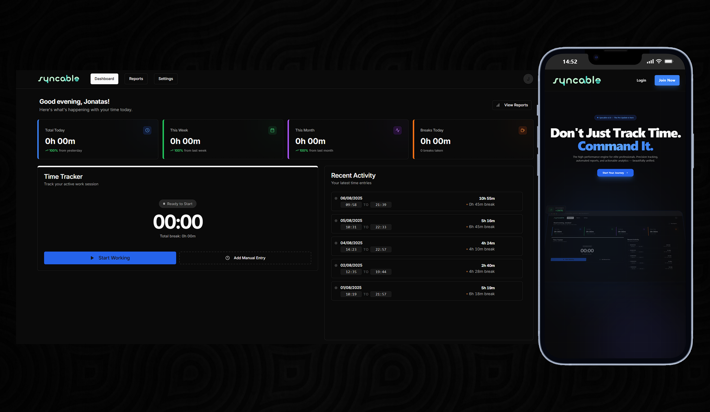

# Syncable - Gestão de Ponto & Payroll Dashboard

Plataforma moderna, intuitiva e responsiva desenvolvida para profissionais e empresas que buscam simplicidade e precisão no controle de jornada. O **Syncable** elimina a burocracia do registro de ponto, oferecendo uma experiência focada no que realmente importa: seu tempo.

<h1 align="center">
  
</h1>

---

## 🚀 Funcionalidades que facilitam sua Jornada

O Syncable foi desenhado para ser seu aliado no dia a dia. Confira como a plataforma simplifica sua gestão:

### 1. ⏱️ Controle de Tempo Inteligente

- **Registro em um Clique:** Bata o ponto de entrada, pausa ou saída instantaneamente.
- **Cronômetro em Tempo Real:** Acompanhe exatamente quanto tempo você já trabalhou no dia.
- **🕒 Entrada/Saída Atrasada:** Esqueceu de bater o ponto? Sem problemas. Ajuste seu horário de início ou fim retroativamente com facilidade.
- **Pausas Flexíveis:** Gestão completa de intervalos para garantir que seu descanso seja computado corretamente.

### 2. 📊 Insights e Métricas Claras

- **Dashboard Visual:** Entenda sua produtividade através de cards intuitivos (Total Trabalhado, Tempo de Pausa, Horas Restantes).
- **Gráficos Dinâmicos:** Visualize seu desempenho semanal e mensal de forma gráfica e elegante.
- **Status Instantâneo:** Saiba se você está "Em Atividade", "Em Pausa" ou se sua jornada já foi concluída.

### 3. 📄 Relatórios Profissionais em Segundos

- **Geração Intuitiva:** Esqueça formulários complexos. Use nosso fluxo guiado para criar relatórios diários, semanais ou mensais.
- **Personalização Completa:** Escolha incluir seu **Nome** e **CPF/CNPJ** para relatórios prontos para contabilidade.
- **Exportação Master:** Gere arquivos **CSV/Excel** formatados perfeitamente para abrir em qualquer software de planilha.

### 4. 🖋️ Anotações e Detalhamento

- **Observações com Formatação:** Adicione notas detalhadas sobre suas tarefas usando um editor de texto rico (negrito, listas, etc.).
- **Edição Retroativa:** Precisa atualizar o que fez? Você pode editar suas observações mesmo após finalizar o dia.
- **Visão Expandida:** Revise suas atividades passadas em uma tabela organizada que esconde detalhes para manter o foco, mas os revela em um clique.

### 5. 🔗 Compartilhamento Seguro

- **Links Blindados:** Compartilhe seus relatórios através de links protegidos por tokens únicos.
- **Controle de Expiração:** Defina por quanto tempo o link ficará ativo (1 dia, 1 semana, etc.).
- **Privacidade Total:** Escolha se quem recebe o link pode ver seus gráficos de performance ou apenas as horas brutas.

---

## 🛠️ Tecnologias

  
  
  
  
  
  
  
  
  
  

---

## 📅 Histórico de Versões

Confira todas as melhorias e novos recursos em nosso log oficial:
👉 **[Ver Histórico Completo em RELEASES.md](./RELEASES.md)**

---

## 👨‍💻 Time e Desenvolvimento

  
   
  <strong>Jonatas Silva</strong>
   
  Senior Software Engineer / CTO & Tech Lead at <a href="https://pokernetic.com/">PokerNetic</a>

---

## 📄 Licença

Este projeto é privado e de uso restrito da **Syncable Corporation**.

  Built with ❤️ by <a href="https://github.com/JsCodeDevlopment">Jonatas Silva</a>

